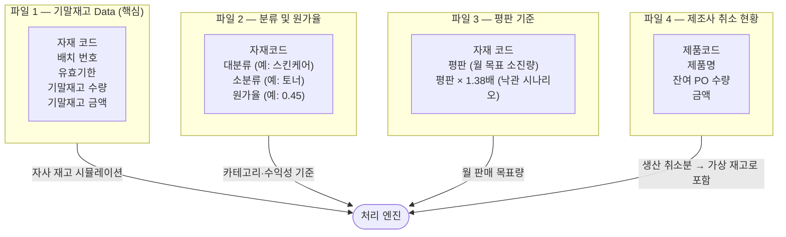
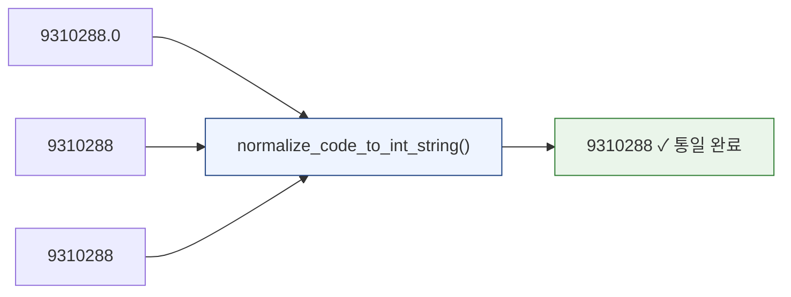
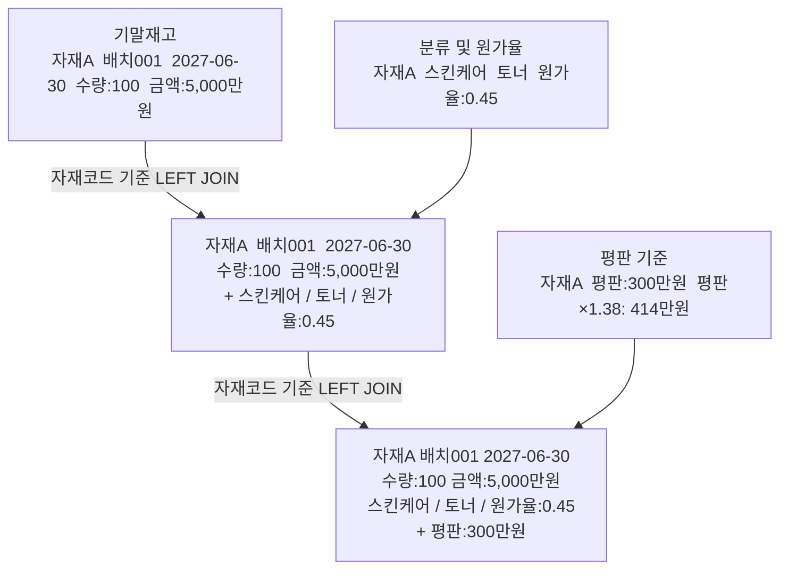
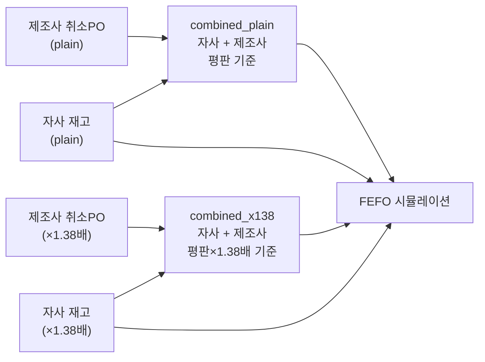
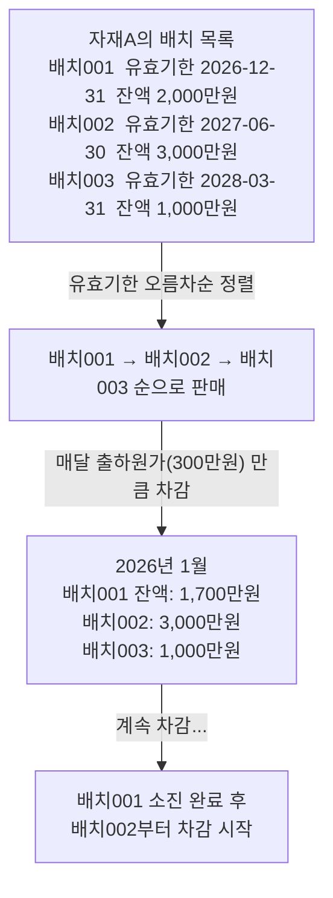
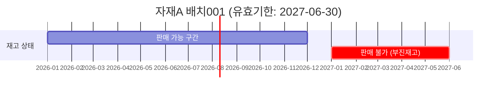
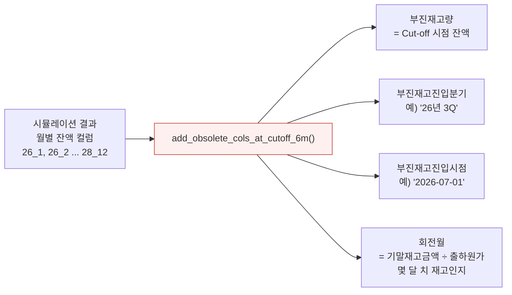
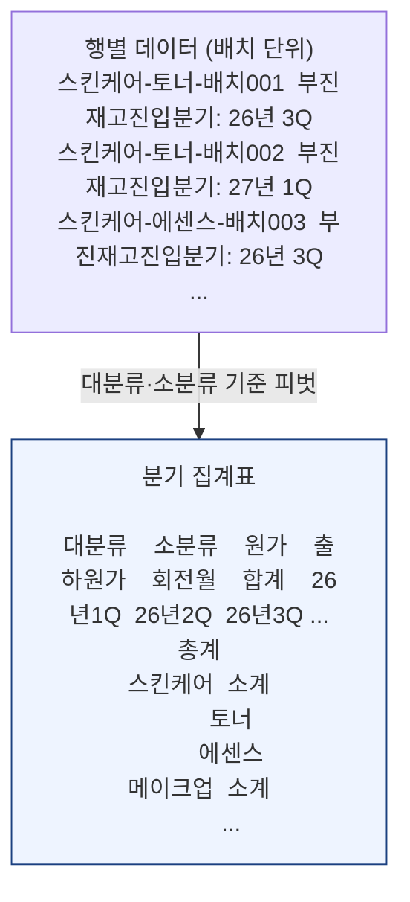
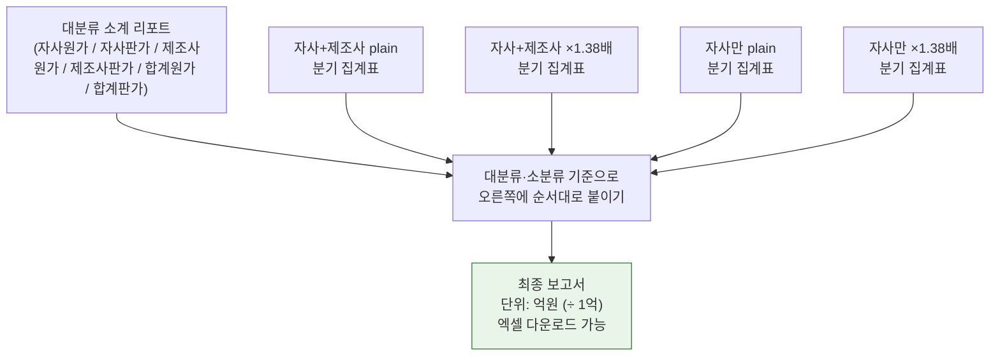

# 재고 시뮬레이션 완전 가이드

> 이 문서는 `5_Inventory_Simulation.py`가 **무엇을 하는지**, **어떤 순서로 처리하는지**를
> 처음 보는 사람도 이해할 수 있도록 단계별로 설명합니다.

---

## 한 줄 요약

> **"지금 창고에 있는 재고가 앞으로 매달 얼마나 팔릴지 시뮬레이션해서,
> 유통기한 안에 다 못 팔고 남을 재고(부진재고)가 얼마나 되는지 예측합니다."**

---

## 전체 흐름 한눈에 보기


---

## STEP 1 · 필요한 파일 4개



> **파일 4(제조사 취소 현황)** 는 실제로 입고되지 않지만,
> 기존에 발주했다가 취소된 수량입니다.
> 이 물량을 "앞으로 들어올 수도 있는 재고"로 보고 같이 분석합니다.

---

## STEP 2 · 자재코드 정규화 — 왜 필요한가?

파일마다 자재코드 형식이 다를 수 있습니다.

```
파일 A: "9310288.0"   (엑셀에서 숫자로 저장됨)
파일 B: "9310288"     (문자로 저장됨)
파일 C: " 9310288 "   (앞뒤 공백 있음)
```

이 세 가지를 모두 `"9310288"` 로 통일합니다.
통일하지 않으면 같은 자재인데 매핑이 안 되는 문제가 발생합니다.



---

## STEP 3 · 데이터 매핑 — 재고에 정보 붙이기

기말재고 파일에는 수량과 금액만 있습니다.
여기에 **분류**, **원가율**, **평판(월 판매 목표)** 을 Left Join으로 붙입니다.



**매핑 후 자동 계산되는 파생 컬럼:**

| 컬럼 | 계산식 | 의미 |
|------|--------|------|
| 단가 | 기말재고금액 ÷ 기말재고수량 | 개당 원가 |
| 출하원가 | 단가 × 평판 | 한 달에 소진되는 금액 |
| 출하판가 | 출하원가 ÷ 원가율 | 한 달 예상 판매 매출 |
| 판가 | 기말재고금액 ÷ 원가율 | 총 재고의 판매가 환산액 |

---

## STEP 4 · 자사 + 제조사 통합

매핑이 완료된 두 데이터를 하나로 합칩니다.
시나리오는 **평판 기준**과 **평판 × 1.38배** 두 가지로 분리합니다.



> 시뮬레이션은 총 4가지 조합으로 실행됩니다.
> - `combined_plain` (자사+제조사, 평판)
> - `combined_x138` (자사+제조사, 평판×1.38배)
> - `mapped_self_plain` (자사만, 평판)
> - `mapped_self_x138` (자사만, 평판×1.38배)

---

## STEP 5 · FEFO 시뮬레이션 — 핵심 로직

**FEFO = First Expired, First Out**
유통기한이 가장 빨리 끝나는 배치부터 먼저 팝니다.

### 5-1. 기본 소진 방식



### 5-2. 판매 중단 규칙 (Cut-off D-6개월)

유통기한 **6개월 전**이 되면 더 이상 판매할 수 없다고 가정합니다.

```
예시: 유효기한이 2027년 6월 30일인 배치

  판매 가능 기간: ~ 2026년 12월 31일  (D-6개월)
  판매 불가 시작: 2027년 1월 1일부터
  부진재고 = 2026년 12월 시점의 잔액
```



### 5-3. 시즌 아이템 제약

일부 자재코드는 **5~8월에만** 판매된다고 가정합니다.

```
시즌 아이템 (예: 선크림)
  → 1·2·3·4·9·10·11·12월: 소진 없음 (재고 유지)
  → 5·6·7·8월: 정상 소진

일반 아이템
  → 12개월 내내 정상 소진
```

---

## STEP 6 · 부진재고 분석

시뮬레이션 완료 후, 각 배치의 **Cut-off 시점 잔액**을 읽어서
부진재고 관련 컬럼을 추가합니다.



**회전월 읽는 법:**
- 회전월 = 3 → 현재 재고가 3달치 판매량에 해당
- 회전월 = 24 → 재고가 2년치나 쌓여 있음 (위험)

---

## STEP 7 · 분기 집계표

행별(배치별) 데이터를 **대분류·소분류 카테고리** 기준으로 집계합니다.



**집계표 컬럼 설명:**

| 컬럼 | 설명 |
|------|------|
| 원가 | 해당 카테고리 기말재고 총 원가 |
| 출하원가 | 월 예상 소진 금액 (= 단가 × 평판의 합) |
| 출하판가 | 월 예상 매출 (출하원가 ÷ 원가율) |
| 회전월 | 원가 ÷ 출하원가 (숫자가 클수록 재고 부담 높음) |
| 합계 | 시뮬레이션 기간 내 총 부진재고 진입 금액 |
| 26년 1Q ~ 28년 4Q | 해당 분기에 부진재고로 진입하는 금액 |

---

## STEP 8 · 최종 보고서 병합

4개의 시나리오별 분기 집계표를 **대분류 소계 리포트** 오른쪽에 가로로 붙입니다.



---

## 시나리오 2가지의 차이

| | 평판 (plain) | 평판 × 1.38배 (x138) |
|--|--------------|----------------------|
| 가정 | 현재 판매 목표 그대로 | 판매가 38% 더 잘 된다고 가정 |
| 소진 속도 | 느림 | 빠름 |
| 부진재고 | 더 많이 잡힘 | 더 적게 잡힘 |
| 활용 | 보수적 (위험 관리) | 낙관적 (목표 달성 시) |

> 두 시나리오를 함께 보면 **최악의 경우와 최선의 경우** 범위를 파악할 수 있습니다.

---

## 최종 출력 화면 구성

```
[실행 버튼 클릭]
│
├── 원본 데이터 미리보기 (접기/펼치기)
│
├── 매핑 결과 확인
│   ├── 탭: 자사 기말재고 매핑
│   └── 탭: 제조사 취소 PO 매핑
│
├── 대분류 소계 통합 리포트
│
├── FEFO 입력 데이터 확인 (접기/펼치기)
│   ├── 탭: 평판 기준 입력 데이터 + 엑셀 다운로드
│   └── 탭: 평판 × 1.38배 입력 데이터 + 엑셀 다운로드
│
├── 시뮬레이션 결과 요약
│   ├── 탭: 평판 (자사+제조사)
│   └── 탭: 평판 × 1.38배 (자사+제조사)
│
├── 분기 집계표
│   ├── 탭: 평판 기준
│   └── 탭: 평판 × 1.38배 기준
│
└── 보유재고 운영 시뮬레이션 보고 (단위: 억원)
    └── 엑셀 다운로드
```

---

## 자주 묻는 질문

**Q. 평판이 없는 자재(평판 = 0)는 어떻게 처리되나요?**
> 유효기한을 2099-12-31로 자동 설정합니다.
> 시뮬레이션 기간(최대 2028년)에는 판매 중단 시점(D-6)이 오지 않으므로
> 부진재고로 잡히지 않습니다.

**Q. 배치 정보가 없으면 실행이 안 되나요?**
> 기말재고 파일에 `배치` 컬럼이 없으면 오류가 발생합니다.
> FEFO는 배치별 유효기한을 기반으로 동작하기 때문에 배치 정보가 필수입니다.

**Q. 회전월 숫자가 너무 크면 무슨 의미인가요?**
> 회전월 = 원가 ÷ 출하원가(월 소진액)입니다.
> 예) 회전월 36 = 현재 재고가 3년치 판매량 → 재고 과잉 위험 신호

**Q. 분기 집계표에서 숫자가 0인 분기는?**
> 해당 분기에 부진재고로 진입하는 자재가 없다는 뜻입니다.
> (그 분기 이전에 소진 완료되거나, 유효기한이 그 이후인 경우)
.
