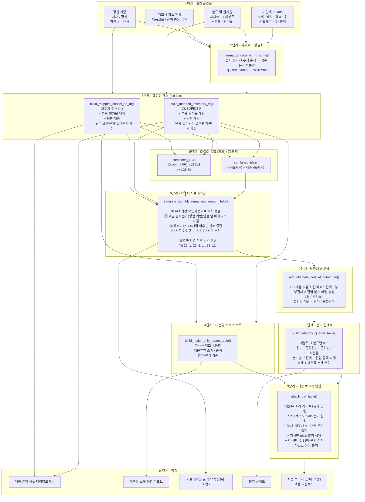

# 재고 시뮬레이션 페이지 설명서

> **파일 위치**: `pages/5_Inventory_Simulation.py`
> **목적**: 자사 기말재고 + 제조사 취소 PO를 통합하여 FEFO 방식으로 월별 재고 소진을 시뮬레이션하고, 부진재고 리스크를 분기별로 집계합니다.

---

## 전체 처리 흐름도



---

## 입력 파일 상세

| 파일 | 필수 컬럼 | 역할 |
|------|-----------|------|
| **기말재고 Data** | 자재, 배치, 유효 기한(또는 유효기간/유효기한), 기말 재고 수량, 기말 재고 금액 | 현재 창고의 배치별 실재고. FEFO 시뮬레이션의 핵심 입력 |
| **분류 및 원가율** | 자재코드, 대분류, 소분류, 원가율 | 자재를 카테고리로 그룹화하고 판가 환산에 사용 |
| **평판 기준** | 자재, 평판, 평판 × 1.38배 | 월별 목표 소진량(판매량). 두 가지 시나리오로 시뮬레이션 |
| **제조사 취소 현황** | 제품코드, 제품명, 잔여 PO, 금액 | 생산 취소된 물량을 가상 재고로 포함해 통합 분석 |

---

## 핵심 로직 3가지

### 1. FEFO (First-Expired-First-Out)
유통기한이 **가장 빨리 끝나는 배치**부터 먼저 소진합니다.

```
매달 소진량 = 출하원가 (= 단가 × 평판)
잔액 = 전월 잔액 - 소진량  (0 미만이면 0으로 고정)
```

### 2. 판매 중단 Cut-off (D-6개월)
유통기한 만료 **6개월 전**부터 판매 불가로 간주합니다.
이 시점에 남아 있는 재고가 **부진재고(Obsolete)** 로 분류됩니다.

```
Cut-off 시점 = 유효기한 - 6개월
부진재고량 = Cut-off 시점의 잔액
```

### 3. 시즌 아이템 제약
지정된 자재코드는 **5·6·7·8월**에만 판매가 발생한다고 가정합니다.
그 외 달에는 소진이 일어나지 않고 잔액이 유지됩니다.

---

## 시뮬레이션 시나리오 4종

| 시나리오 | 대상 | 평판 기준 |
|----------|------|-----------|
| `combined_plain` | 자사 + 제조사 | 평판 |
| `combined_x138` | 자사 + 제조사 | 평판 × 1.38배 |
| `sim_self_plain` | 자사만 | 평판 |
| `sim_self_x138` | 자사만 | 평판 × 1.38배 |

> **평판 × 1.38배**는 보수적 가정으로, 더 빠른 소진을 가정하여 낙관적 시나리오를 나타냅니다.

---

## 출력 컬럼 예시 (최종 보고서)

| 컬럼군 | 예시 |
|--------|------|
| 카테고리 | 대분류, 소분류 |
| 기본 KPI | 자사 원가, 자사 판가, 제조사 원가, 제조사 판가, 합계 원가, 합계 판가 |
| plain 시나리오 | 자사+제조사_회전월, 자사+제조사_합계, 자사+제조사_26년 1Q, ... |
| ×1.38배 시나리오 | 자사+제조사1.38배_회전월, 자사+제조사1.38배_합계, ... |
| 자사만 | 자사_회전월, 자사_합계, 자사_26년 1Q, ... |
| 단위 | **억원** (÷ 100,000,000) |

---

## 시뮬레이션 설정 옵션

| 옵션 | 기본값 | 설명 |
|------|--------|------|
| 시작 연도/월 | 2026년 1월 | 시뮬레이션 시작 시점 |
| 종료 연도/월 | 2028년 12월 | 시뮬레이션 종료 시점 |
| 시즌 자재코드 | 12개 코드 | 여름철(5~8월)에만 판매되는 자재 목록 |
