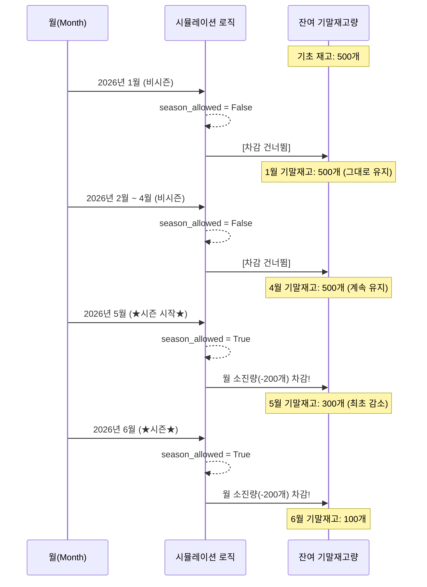

# 시즌 자재(계절성 상품) 재고 시뮬레이션 로직 설명

해당 문서에서는 자재코드 **9305997** 처럼 특정 기간에만 판매되는 "시즌 자재"가 **FEFO 시뮬레이션(`simulate_monthly_remaining_amount_fefo` 함수)** 내에서 어떻게 동작하고 예산(수량)을 차감하는지, **코드 구조**와 **실제 흐름 예시**를 통해 자세히 설명합니다.

---

## 1. 코드 상의 처리 로직 요약

1.  **시즌 품목 여부 식별**: 시스템은 사용자가 설정한 시즌 코드 목록에 포함된 자재코드들을 읽어, 시뮬레이션 데이터를 불러올 때 `_is_season` 이라는 꼬리표(True)를 달아둡니다.
2.  **월별 순회 시 허용 여부 판별**: 시뮬레이션이 2026년 1월부터 12월까지 **월 단위(`mm`)**로 반복(Loop)하며 계산을 수행할 때, 해당 월(`mm`)이 유효한 시즌인지 검사합니다 (`season_allowed = mm in season_months`).
3.  **차감 생략(`continue`)**: 대상 자재가 시즌 자재이면서 현재 달이 판매 시즌월이 아니라면, 재고 차감 로직을 실행하지 않고 다음 자재나 다음 월로 무조건 건너뜁니다.

### 핵심 코드 블록 (`pages/5_Inventory_Simulation.py`)

```python
622: season_allowed = (mm in season_months) # (예: 5,6,7,8월이면 True, 아니면 False)
...
624: for mat, idx_list in grouped.items(): # 자재별로 반복
625:     # 1단계: 이 자재가 시즌 자재(True)인지 판별 (예: 9305997 -> True)
626:     is_season_item = bool(mat_season_map.get(mat, False)) if mat_season_map else False
627:     
628:     # 2단계: 시즌 자재인데, 지금이 시즌 월(5~8월)이 아니라면?
629:     if is_season_item and not season_allowed:
630:         if yy == 2026 and "9305997" in str(mat) and debug_logs is not None:
631:             debug_logs.append(f"[{debug_name} 2026 DEBUG] {yy}-{mm:02d} | 자재: {mat} | 소진 건너뜀 (사유: 시즌 자재이며 {mm}월은 판매 시즌이 아님)")
632:         # 3단계: 하단의 계산(차감 루틴)을 전혀 실행하지 않고 건너뜀
633:         continue  
```

---

## 2. 시즌 자재 소진 예시 다이어그램

아래 예시는 시즌 자재인 **9305997**의 재고가 1월부터 6월까지 시간이 흐르면서 어떻게 변하는지 보여줍니다.
*(가정: 이월된 기초재고 500개 / 출하원가(월별 소진 예상량) 200개 / 시즌은 5월~8월)*



## 3. 요약

시즌 자재(9305997 등)는 재고가 충분히 있고, 매월 팔려나갈 출하원가(소진 예산)가 정해져 있다 할지라도, **설정된 특정 기간(5월~8월)이 도래하기 전까지는 수량이 감소하지 않고 계속해서 이월**됩니다. 

따라서 시뮬레이션 상 1월부터 4월까지의 기말 재고량이 전월과 100% 동일한 수치로 나타나는 것은 예산이나 단가 문제로 인한 버그가 아니라 **코드상 `continue` 구조에 의한 정상적인 시즌성 제약 동작**입니다.
